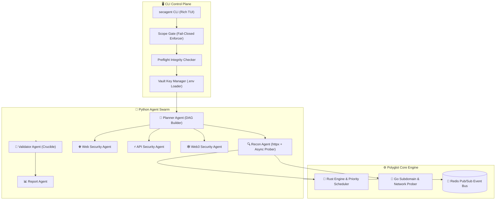
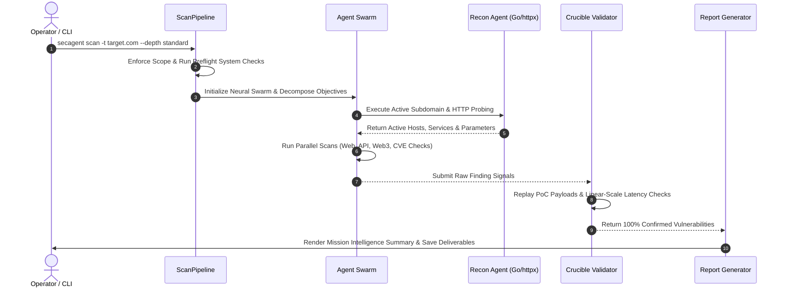
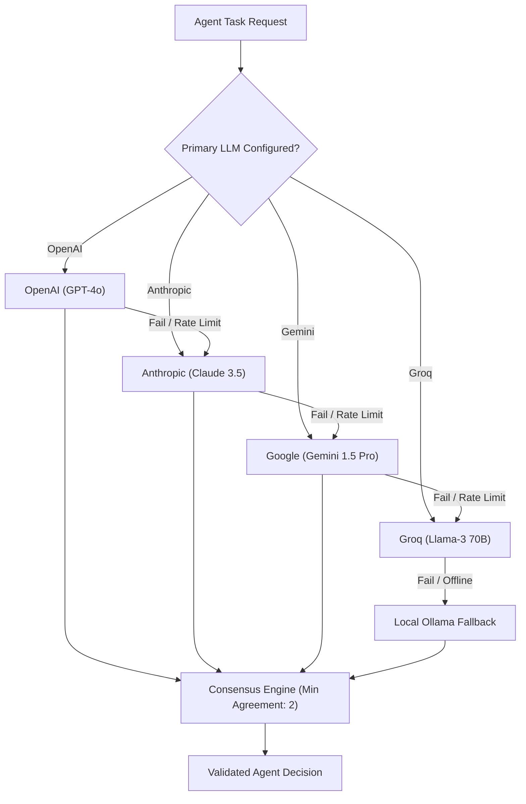

<div align="center">

```text
    _____           ___                    __
   / ___/___  _____/   | ____ ____  ____  / /______
   \__ \/ _ \/ ___/ /| |/ __ `/ _ \/ __ \/ __/ ___/
  ___/ /  __/ /__/ ___ / /_/ /  __/ / / / /_(__  )
 /____/\___/\___/_/  |_\__, /\___/_/ /_/_/   \___/
                      /____/
```

**Autonomous Offensive AI Framework for Red Teams & Security Researchers**

*Industrial Power. Elite Intelligence. Mission Ready.*

---

[](https://opensource.org/licenses/MIT)
[](https://www.python.org/downloads/)
[](https://www.rust-lang.org/)
[](https://go.dev/)
[](https://github.com/gl1tch0x1/cog-ai)
[](https://github.com/astral-sh/ruff)
[]()

</div>

---

> ⚠️ **LEGAL DISCLAIMER** — SecAgent is designed exclusively for **authorized security testing, red team engagements, and vulnerability research** on systems you own or have explicit written permission to test. Unauthorized use against systems without permission is illegal. The authors assume no liability for misuse.

---

## 📋 Table of Contents

- [What Is SecAgent](#-what-is-secagent)
- [Key Differentiators](#-key-differentiators)
- [Capabilities Matrix](#-capabilities-matrix)
- [Comprehensive System Architecture](#-comprehensive-system-architecture)
  - [1. High-Level System Topology \& Polyglot Engine](#1-high-level-system-topology--polyglot-engine)
  - [2. Autonomous Scan Lifecycle Sequence](#2-autonomous-scan-lifecycle-sequence)
  - [3. Multi-Agent Swarm Decision Logic](#3-multi-agent-swarm-decision-logic)
  - [4. Multi-Provider LLM Fallback \& Consensus Engine](#4-multi-provider-llm-fallback--consensus-engine)
- [Quick Start Guide](#-quick-start-guide)
- [Installation Guide](#-installation-guide)
  - [Prerequisites](#prerequisites)
  - [Method 1 — Automated Installation Engine (Recommended)](#method-1--automated-installation-engine-recommended)
  - [Method 2 — Manual Package Installation](#method-2--manual-package-installation)
- [Releases, Deployments \& Packages](#-releases-deployments--packages)
  - [🏷️ Releases](#️-releases)
  - [🚢 Deployment Models](#-deployment-models)
  - [📦 Package Artifacts](#-package-artifacts)
- [Configuration \& Operational Manifest](#-configuration--operational-manifest)
- [Complete CLI Usage Reference](#-complete-cli-usage-reference)
  - [Subcommand Specifications \& Flags](#subcommand-specifications--flags)
- [Sample Deliverables \& Deliverable Schemas](#-sample-deliverables--deliverable-schemas)
  - [1. Executive Markdown Deliverable](#1-executive-markdown-deliverable)
  - [2. Machine-Readable JSON Schema](#2-machine-readable-json-schema)
- [Project Directory Layout](#-project-directory-layout)
- [Troubleshooting \& Operations Guide](#-troubleshooting--operations-guide)
- [Contributing \& Security Policy](#-contributing--security-policy)
- [License](#-license)

---

## ⚔️ What Is SecAgent

Traditional vulnerability scanners are **rigid, noisy, and context-blind.** They execute static pattern matching, miss complex multi-stage attack vectors, and flood security operators with false positives that waste valuable time.

**SecAgent is an Autonomous, Pure-CLI Red Teaming & Offensive Intelligence Framework.**

It operates as a **Distributed Cognitive Security Engine** — harnessing specialized multi-agent AI swarms that *reason* through attack surfaces the way an elite red-team operator does. SecAgent identifies technology stacks, enumerates subdomains and HTTP endpoints via active `httpx` and Go probes, crafts context-aware exploits, validates vulnerabilities through deterministic proof-of-concepts, and generates correlated, impact-first deliverables.

Built for:
- 🔴 **Red Teams** executing full-scope autonomous engagements
- 🔬 **Security Researchers** performing automated attack surface discovery & zero-day research
- 🐛 **Bug Bounty Hunters** conducting active recon and vulnerability verification
- 🛡️ **Offensive AI Researchers** auditing AI supply chains, prompt injections, and RAG pipelines

---

## 🚀 Key Differentiators

1. **Pure CLI-First Architecture**: No bloated web UI or complex database setup required. Designed for headless VPS execution, Docker containers, SSH sessions, and CI/CD pipelines.
2. **Polyglot Performance Engine**: High-speed Go microservices for concurrent network probing, Rust for microsecond priority scheduling, and Python for LLM multi-agent reasoning.
3. **Zero False-Positive Validation**: Integrated `CrucibleValidator` replays proof-of-concept payloads against target endpoints to verify vulnerabilities before reporting.
4. **Hardware-Aware Local Fallback**: Automatically detects GPU/CPU capabilities to provision local Ollama models (`llama3`, `mistral`, `codellama`) when cloud APIs are unavailable.
5. **Multi-Provider LLM Consensus**: Routes tasks across OpenAI, Anthropic, Gemini, Groq, and DeepSeek with automated fallback chains and agreement thresholding.

---

## 💀 Capabilities Matrix

| Module | Sub-Components | Operational Description |
|--------|----------------|-------------------------|
| 🧠 **Neural Swarm Orchestration** | `Orchestrator`, `ArmadaSwarm`, `TaskDAG` | Decomposes high-level objectives into directed acyclic execution graphs (DAGs) with retry and circuit breaker logic. |
| 🔍 **Active Recon Engine** | `ReconAgent`, `GoRecon`, `httpx` Prober | Active subdomain resolution, TLS/header probing, HTML crawling, link extraction, and GET/POST parameter discovery. |
| 🌐 **Web Security Scanner** | `WebSecurityAgent`, `CVEChecks` | 31+ vulnerability classes including SQLi, XSS, SSTI, LFI, RFI, SSRF, RCE, Command Injection, and Log4Shell. |
| ⚡ **API Security Scanner** | `APISecurityAgent` | REST & GraphQL introspection, BOLA/IDOR detection, JWT algorithm manipulation (`none` alg), and CORS misconfigurations. |
| 🕸️ **Web3 & Contract Auditor** | `Web3SecurityAgent` | EVM & Solana smart contract security analysis for reentrancy, integer overflow, delegatecall vulnerabilities, and access control bypasses. |
| 🛡️ **AI Supply Chain Audits** | `PromptInjectionCheck` | Audits `.cursorrules`, `mcp.json`, system prompts, RAG data exfiltration vectors, and indirect prompt injections. |
| 🔬 **PoC Verification** | `CrucibleValidator` | Replays generated exploit payloads in sandbox environments to ensure zero false positives. |
| ⛓️ **Exploit Chain Correlation** | `ChainCorrelator` | Links isolated vulnerabilities into complete end-to-end multi-step exploit paths. |
| 📊 **Impact-First Reporting** | `ReportAgent` | Generates executive Markdown reports and machine-readable JSON artifacts. |

---

## 🏛️ Comprehensive System Architecture

### 1. High-Level System Topology & Polyglot Engine



---

### 2. Autonomous Scan Lifecycle Sequence



---

### 3. Multi-Agent Swarm Decision Logic


---

### 4. Multi-Provider LLM Fallback & Consensus Engine



---

## ⚡ Quick Start Guide

```bash
# 1. Clone the repository
git clone https://github.com/gl1tch0x1/cog-ai.git
cd cog-ai

# 2. Run the automated deployment engine
python installer.py

# 3. Configure environment secrets
cp .env.example .env
nano .env  # Add OPENAI_API_KEY, ANTHROPIC_API_KEY, or GEMINI_API_KEY

# 4. Initiate an autonomous red-team scan
secagent scan --target example.com --depth standard
```

---

## 🛠️ Installation Guide

### Prerequisites

| Requirement | Minimum | Recommended | Notes |
|-------------|---------|-------------|-------|
| **OS** | Windows / Linux / macOS | Linux / macOS / WSL2 | Fully supported on native Windows PowerShell & Linux |
| **Python** | 3.11+ | Python 3.11, 3.12, 3.13 | Verified compatibility across environments |
| **Git** | Installed | Latest | Version control & update engine |
| **Docker** | *(Optional)* | 20.10+ | Containerized sandbox execution (`--no-sandbox` to bypass) |

---

### Method 1 — Automated Installation Engine (Recommended)

The installer sets up virtual environments, mounts core dependencies, creates entrypoints, and verifies system integrity:

```bash
python installer.py
```

### Method 2 — Manual Package Installation

For developer control or integration into existing Python environments:

```bash
# 1. Create and activate virtual environment
python -m venv venv

# Windows PowerShell:
.\venv\Scripts\Activate.ps1
# Linux / macOS:
source venv/bin/activate

# 2. Install secagents package in editable mode
pip install -e ./python-agents[dev,browser]
```

---

## 📦 Releases, Deployments & Packages

### 🏷️ Releases
- **Current Version**: `v0.3.0-dev`
- **Release Tracking**: Managed via [CHANGELOG.md](file:///c:/Users/Acer/Downloads/SecAgent-Updated/SecAgent-Updated/CHANGELOG.md)
- **Tagging**: Follows Semantic Versioning (`MAJOR.MINOR.PATCH`).

### 🚢 Deployment Models

SecAgent is engineered for flexible deployment across local machines, remote servers, and containerized clusters.

#### Docker Compose Deployment
Run core background microservices (Redis event bus, Rust engine, Go prober):
```bash
docker compose up -d
```
Container inventory:
- `redis`: Pub/Sub event bus (`:6379`)
- `rust-core`: Rust priority task scheduler
- `recon`: Go high-concurrency network prober

#### Standalone CLI Binary Deployment
The installer generates executable binary wrappers for quick invocation:
- **Windows**: `secagent.bat`
- **Linux/macOS**: `./secagent`

---

### 📦 Package Artifacts

The Python agent core is packaged as a standard PyPI wheel:

```bash
# Build python package wheel
cd python-agents
python -m build
```
Artifact generated: `python-agents/dist/secagents-0.2.0-py3-none-any.whl`.

---

## ⚙️ Configuration & Operational Manifest

Operational parameters and API credentials are read from `.env`:

```env
# ─── Primary LLM Provider Keys ───
OPENAI_API_KEY=sk-proj-...
ANTHROPIC_API_KEY=sk-ant-...
GEMINI_API_KEY=AIzaSy...
GROQ_API_KEY=gsk_...
DEEPSEEK_API_KEY=sk-...

# ─── Local LLM Configuration ───
OLLAMA_HOST=http://localhost:11434
DEFAULT_LOCAL_MODEL=llama3:8b

# ─── Operational Scope & Infrastructure ───
ALLOWED_DOMAINS=example.com,target.local
REDIS_URL=redis://localhost:6379/0
RESULTS_DIR=cog-ai-results
SECAGENT_VERIFY_SSL=true
```

---

## 💻 Complete CLI Usage Reference

```text
usage: secagent [-h] [--version]
                {scan,vault,keyhacks,preflight,update,hardware,worker} ...

SecAgent — Autonomous Offensive AI Framework (authorized testing only)

positional arguments:
  {scan,vault,keyhacks,preflight,update,hardware,worker}
    scan                Execute autonomous red-team pipeline
    vault               Interface with secret storage and API keys
    keyhacks            Scan local assets for leaked credentials
    preflight           Validate system readiness
    update              Check and apply framework updates
    hardware            Hardware-aware model optimization
    worker              Start background workflow processor

options:
  -h, --help            show this help message and exit
  --version             show program's version number and exit
```

### Subcommand Specifications & Flags

#### 1. `secagent scan` — Autonomous Red-Team Pipeline
```bash
secagent scan --target <domain/URL> [options]

Options:
  --target, -t TEXT       Target domain or URL [Required]
  --depth {quick,standard,deep}  Scan intensity (default: standard)
  --workers, -w INT       Parallel agent swarm size (default: 4)
  --skip-os-check         Bypass OS security baseline check
  --no-sandbox            Bypass Docker Fortress isolation
  --no-arsenal            Skip heuristic Arsenal probes
  --insecure              Bypass SSL/TLS verification
  --setup-local-llm       Auto-provision local Ollama model
  --results-dir PATH      Output directory for deliverables (default: cog-ai-results)
```

#### 2. `secagent vault` — Key Integrity Manager
```bash
secagent vault --validate --env .env
```

#### 3. `secagent keyhacks` — Credential Audit
```bash
secagent keyhacks ./src --rate-limit 10.0
```

#### 4. `secagent preflight` — System Readiness Verification
```bash
secagent preflight
```

#### 5. `secagent hardware` — Hardware Detection
```bash
secagent hardware
```

#### 6. `secagent update` — Intelligence Synchronization
```bash
secagent update
```

---

## 📊 Sample Deliverables & Deliverable Schemas

### 1. Executive Markdown Deliverable
```markdown
# 🛡️ Mission Intelligence Deliverable: example.com

## Executive Summary
SecAgent executed an autonomous security audit against target domain `example.com`. 
A total of **3 validated vulnerabilities** were extracted with zero false positives.

### Key Finding Matrix
| Severity | Vulnerability | Location | Confidence | CWE |
| :--- | :--- | :--- | :---: | :--- |
| **CRITICAL** | SQL Injection | `/api/users?id=` | 95% | CWE-89 |
| **HIGH** | Reflected XSS | `/search?q=` | 90% | CWE-79 |
| **HIGH** | Insecure Direct Object Reference | `/api/users/102` | 85% | CWE-639 |

---

## Technical Finding Details

### 1. SQL Injection (`CWE-89`)
- **Target URL**: `https://example.com/api/users`
- **Method**: `GET`
- **Payload**: `' UNION SELECT NULL--`
- **Proof Signal**: `You have an error in your SQL syntax near '1'`
```

### 2. Machine-Readable JSON Schema (`target.json`)
```json
{
  "target": "example.com",
  "domain": "example.com",
  "findings": [
    {
      "type": "sqli",
      "severity": "critical",
      "url": "https://example.com/api/users",
      "payload": "' UNION SELECT NULL--",
      "confidence": 0.95,
      "cwe": "CWE-89",
      "poc_url": "https://example.com/api/users?id=' UNION SELECT NULL--"
    }
  ]
}
```

---

## 📁 Project Directory Layout

```text
SecAgent/
├── python-agents/                     # Primary Python AI Agent Swarm & CLI Engine
│   ├── pyproject.toml                 # Package configuration, scripts, & dev dependencies
│   └── secagents/
│       ├── agents/                    # Autonomous Specialist Agent Swarms
│       │   ├── api_security.py        # REST/GraphQL vulnerability prober & BOLA checker
│       │   ├── base.py                # BaseAgent class with confidence scoring & standard formatting
│       │   ├── keyhacks.py            # Local asset secret & credential leak scanner
│       │   ├── planner.py             # Phase decomposer, resource allocator, risk identifier
│       │   ├── recon.py               # Active DNS prober, httpx crawler, parameter discovery
│       │   ├── report.py              # Markdown deliverable generator & finding summarizer
│       │   ├── supervisor.py          # Action intent classifier & swarm director
│       │   ├── validator.py           # Proof-of-Concept verification & replay engine
│       │   ├── web3_security.py       # Smart contract auditor (EVM & Solana vulnerability prober)
│       │   └── web_security.py        # Web vulnerability scanner (SQLi, XSS, SSTI, LFI, SSRF, RCE)
│       ├── armada/                    # Swarm Handlers & Orchestration Tasks
│       │   ├── handlers.py            # Task handler registration & routing
│       │   └── swarm.py               # Parallel agent swarm runner
│       ├── arsenal/                   # Heuristic Exploitation Probes
│       │   └── exploits.py            # Arsenal payload probes & secondary validation
│       ├── core/                      # Core System Infrastructure
│       │   ├── memory.py              # Persistent memory storage
│       │   ├── orchestrator.py        # Task DAG orchestrator & circuit breaker tracker
│       │   ├── skill_manager.py       # SKILL.md parser & skill registration engine
│       │   └── workers.py             # Async worker pool & queue manager
│       ├── crucible/                  # Verification & Regression Framework
│       │   ├── regression.py          # Test suite regression tracker
│       │   └── validation.py          # Live PoC replay & linear-scaling time verifier
│       ├── engine/                    # Context & Graph Processing
│       │   ├── caveman.py             # Token-efficient prompt compressor
│       │   ├── ci_notifier.py         # CI/CD webhook & alert dispatcher
│       │   └── memory_graph.py        # Graph-based vulnerability relationship store
│       ├── fortress/                  # Isolation & Sandboxing
│       │   └── sandbox.py             # Docker Fortress execution isolation checks
│       ├── hermes/                    # Retrospective Memory Engine
│       │   ├── retrospective.py       # Post-scan analysis & learning feedback loop
│       │   └── store.py               # Hermes persistent memory store
│       ├── infra/                     # Operational Safeguards & Integrity
│       │   ├── preflight.py           # System dependency & prerequisite verifier
│       │   └── scope.py               # Fail-closed target domain scope enforcer
│       ├── intel/                     # Threat Intelligence Integration
│       │   ├── chaos_client.py        # ProjectDiscovery Chaos API integration
│       │   └── shodan_client.py       # Shodan host intelligence integration
│       ├── llm/                       # LLM Provider Abstraction
│       │   ├── consensus.py           # Multi-provider agreement & consensus engine
│       │   └── omni.py                # Unified LLM client (OpenAI, Anthropic, Gemini, Groq, DeepSeek)
│       ├── modules/                   # Deterministic Detection Signatures
│       │   └── cve_checks.py          # 31+ zero-false-positive CVE signatures & check definitions
│       ├── operational/               # Environment & System Integrity
│       │   └── integrity.py           # OS baseline security update & tool updater
│       ├── pipeline/                  # Unified Scan Execution
│       │   └── runner.py              # ScanPipeline orchestrator (Scope -> Preflight -> Swarm -> Report)
│       ├── remediation/               # Auto-Fixing & Patching
│       │   ├── patcher.py             # Auto-remediation code patcher
│       │   └── reporter.py            # Final report formatter & deliverable generator
│       ├── vault/                     # Operational Secret Storage
│       │   └── env_loader.py          # Environment key loader & live API validation
│       ├── whichllm/                  # Hardware-Aware Model Provisioning
│       │   └── hardware.py            # Local GPU/CPU detector & Ollama auto-provisioner
│       └── cli.py                     # Rich CLI Terminal User Interface & subcommand parser
├── go-services/                       # High-Performance Go Microservices
│   ├── recon/                         # High-Speed Recon Engine
│   │   ├── crawler.go                 # Concurrent web page crawler & link extractor
│   │   ├── httpprobe.go               # Multithreaded HTTP/HTTPS service prober
│   │   ├── params.go                  # GET/POST parameter discovery engine
│   │   ├── recon_test.go              # Unit test suite for Go recon
│   │   └── subdomain.go               # Multithreaded DNS brute-force enumerator
│   ├── scanners/                      # Network Scanners
│   │   ├── portscan.go                # Fast TCP port scanner
│   │   └── syn.go                     # Raw SYN packet scanner
│   └── cli/                           # Go CLI Binary Build Entrypoint
│       └── cmd/main.go                # Go CLI entrypoint
├── rust-core/                         # Rust Engine & Priority Task Scheduler
│   ├── Cargo.toml                     # Rust package manifest & dependencies
│   └── src/
│       ├── engine.rs                  # Core Rust execution engine
│       ├── event_bus.rs               # Lock-free event dispatching bus
│       ├── main.rs                    # Rust engine binary main entrypoint
│       ├── policy.rs                  # Security policy evaluation engine
│       ├── scheduler.rs               # Microsecond-latency task priority queue
│       └── state.rs                   # System state tracker
├── skills/                            # Modular Hunting Methodologies
│   ├── bb-methodology/                # Bug bounty methodology guidelines
│   ├── PromptInjection/               # LLM prompt injection audit playbooks
│   ├── Recon/                         # Advanced reconnaissance techniques
│   └── WebAssessment/                 # OWASP Top 10 assessment workflows
├── tests/                             # Unified Test Suite
│   └── unit/
│       ├── test_agents_complete.py    # Unit tests for python agent swarms
│       ├── test_comprehensive.py      # System orchestrator & worker tests
│       └── test_cve_checks.py         # Signature & CVE verification tests
├── docker-compose.yml                 # Production background microservices configuration
├── Makefile                           # Unified build, test, and execution targets
├── installer.py                       # Automated deployment & installation engine
├── update.py                          # Intelligence & framework sync tool
├── SKILL.md                           # Master hunting knowledge base reference
├── LICENSE                            # MIT License distribution terms
├── SECURITY.md                        # Security policy & vulnerability reporting
└── README.md                          # Master documentation & architecture guide
```

---

## 🛠️ Troubleshooting & Operations Guide

### Common Operational Scenarios

#### 1. Bypassing Docker Sandbox Isolation
If Docker is not running or sandbox isolation is not required:
```bash
secagent scan --target example.com --no-sandbox
```

#### 2. Provisioning Offline Local LLM Models
When running in air-gapped environments without cloud API keys:
```bash
secagent scan --target target.local --setup-local-llm
```

#### 3. Resolving SSL Certificate Warnings
For internal staging environments with self-signed SSL certificates:
```bash
secagent scan --target https://staging.local --insecure
```

---

## 🤝 Contributing & Security Policy

### Contributing
1. Fork the repository on GitHub.
2. Create your feature branch (`git checkout -b feature/advanced-cve-check`).
3. Verify test coverage (`pytest`) and linter compliance (`ruff check python-agents`).
4. Commit your changes and submit a Pull Request.

### Reporting Vulnerabilities
To report a security vulnerability within SecAgent itself, please review our [SECURITY.md](file:///c:/Users/Acer/Downloads/SecAgent-Updated/SecAgent-Updated/SECURITY.md) for responsible disclosure guidelines.

---

## 📄 License

Distributed under the MIT License. See [LICENSE](file:///c:/Users/Acer/Downloads/SecAgent-Updated/SecAgent-Updated/LICENSE) for details.
