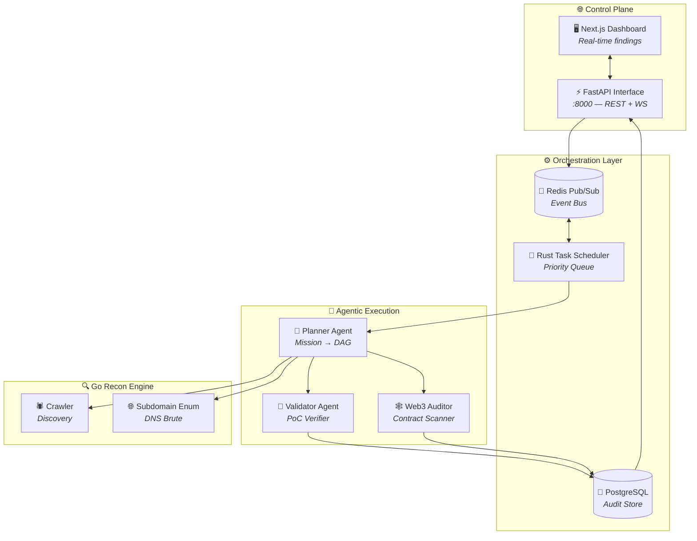
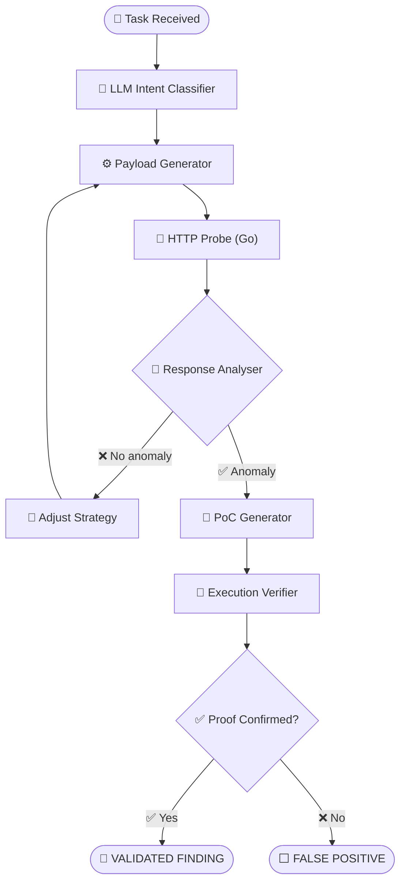

<div align="center">

```
    _____           ___                    __
   / ___/___  _____/   | ____ ____  ____  / /______
   \__ \/ _ \/ ___/ /| |/ __ `/ _ \/ __ \/ __/ ___/
  ___/ /  __/ /__/ ___ / /_/ /  __/ / / / /_(__  )
 /____/\___/\___/_/  |_\__, /\___/_/ /_/_/   \___/
                      /____/
```

**Autonomous Offensive AI Framework for Red Teams & Security Researchers**

*Distributed cognitive system for autonomous red-teaming, vulnerability research, and Web3 auditing.*

---

[](https://opensource.org/licenses/MIT)
[](https://www.python.org/downloads/)
[](https://www.rust-lang.org/)
[](https://go.dev/)
[](https://github.com/gl1tch0x1/cog-ai)
[]()

</div>

---

> ⚠️ **LEGAL DISCLAIMER** — SecAgent is designed exclusively for **authorized security testing, red team engagements, and vulnerability research**. Unauthorized use against systems without permission is illegal. The authors assume no liability for misuse.

---

## 📋 Table of Contents

- [What Is SecAgent](#-what-is-secagent)
- [💀 Capabilities](#-capabilities)
- [🏛️ Architecture](#-architecture)
  - [1. High-Level Topology](#1-system-architecture--high-level-topology)
  - [2. Autonomous Scan Workflow](#2-autonomous-scan-workflow--end-to-end-lifecycle)
  - [3. Agent Decision Logic](#3-agent-architecture--internal-decision-logic)
- [⚡ Quick Start](#-quick-start)
- [🛠️ Installation Guide](#-installation-guide)
  - [Method 1 — Automated (Recommended)](#method-1--automated-recommended)
  - [Method 2 — Docker Stack](#method-2--docker-stack)
- [⚙️ Configuration](#-configuration)
- [🎯 Running Your First Mission](#-running-your-first-mission)
- [📁 Project Structure](#-project-structure)
- [🤝 Contributing](#-contributing)
- [🔍 Troubleshooting](#-troubleshooting)

---

## ⚔️ What Is SecAgent

Traditional scanners are rigid and context-blind. **SecAgent** is an **AI-Native Distributed Cognitive System** that reasons through an attack surface like an elite human operator. It understands tech stacks, identifies high-value attack paths, and generates **deterministic proof-of-concepts** for every confirmed vulnerability.

**Built for:**
- 🔴 **Red Teams** executing complex, full-scope engagements.
- 🔬 **Security Researchers** conducting deep vulnerability research.
- 🕸️ **Web3 Auditors** hunting for smart contract rug-pull vectors.
- 🛡️ **DevSecOps** automating industrial-grade offensive testing.

---

## 💀 Capabilities

| Module | Description |
|--------|-------------|
| 🧠 **Neural Orchestration** | Decomposes mission objectives into atomic execution DAGs |
| 🔍 **Autonomous Recon** | Go-powered concurrent subdomain enumeration and endpoint crawling |
| 🎯 **PoC Generation** | Auto-crafts deterministic Python/cURL proof-of-concepts |
| 🕸️ **Web3 Auditing** | Smart contract auditing for rug-pull vectors (EVM & Solana) |
| 🛡️ **AI Supply Chain Audits** | Detects weaponized AI configs, prompt injection, and RAG leaks |
| 🔬 **Offensive Intelligence** | 20+ vuln classes and 50+ contract red-flags from Claude Bug Bounty |
| 🦾 **Neural Filter** | 99% noise-reduction — findings are consensus-validated |
| ⛓️ **Exploit Chain Correlation** | Links individual findings into full multi-step attack paths |
| 🔁 **Autopilot Mode** | Fire-and-forget autonomous scanning from recon to report |
| 📊 **Structured Reporting** | CVSS 4.0 compliant, impact-first executive Markdown reports |

---

## 🏛️ Architecture

### 1. System Architecture — High-Level Topology



---

### 2. Autonomous Scan Workflow — End-to-End Lifecycle

```mermaid
sequenceDiagram
    autonumber
    actor Operator as 🔴 Operator
    participant CLI as 🖥️ Entrypoint (./secagent)
    participant Planner as 🧠 Planner Agent
    participant Recon as 🔍 Go Recon Engine
    participant Scanners as 🛡️ Specialist Agents
    participant Filter as 🦾 Neural Filter
    participant DB as 🐘 PostgreSQL

    Operator->>CLI: ./secagent scan -t target.com
    CLI->>Planner: Initialize mission

    rect rgb(26, 26, 46)
        Note over Planner,Recon: PHASE 1 — RECONNAISSANCE
        Planner->>Recon: Enumerate subdomains & endpoints
        Recon-->>Planner: Tech stack & attack surface map
    end

    rect rgb(15, 52, 96)
        Note over Planner,Scanners: PHASE 2 — TARGETED SCANNING
        Planner->>Scanners: Dispatch parallel tasks (SQLi, SSRF, IDOR)
        Scanners-->>Planner: Raw finding stream
    end

    rect rgb(83, 52, 131)
        Note over Planner,Filter: PHASE 3 — NEURAL VALIDATION
        Planner->>Filter: Request consensus on findings
        Filter->>Scanners: Execute deterministic PoCs
        Scanners-->>Filter: Proof signals captured
        Filter-->>Planner: Validated findings (Confidence > 0.7)
    end

    Planner->>DB: Persist findings & generate report
    CLI-->>Operator: ✅ Mission Complete: report.md ready
```



---

### 3. Agent Architecture — Internal Decision Logic

How a specialist agent reasons through a vulnerability:



---

## ⚡ Quick Start

Get SecAgent running in under 5 minutes with the automated deployment engine.

```bash
# 1. Clone the repository
git clone https://github.com/gl1tch0x1/cog-ai.git
cd cog-ai

# 2. Deploy the Arsenal
python3 installer.py

# 3. Execute your first mission
./secagent scan --target example.com --depth quick
```

---

## 🛠️ Installation Guide

### Prerequisites
- **Python 3.11+**
- **Docker & Compose** (v2 recommended)
- **Rust** (Required for Python 3.13 dependency builds)
- **At least one LLM API Key** (OpenAI, Anthropic, or Groq)

### Method 1 — Automated (Recommended)
The `installer.py` handles venv creation, binary pre-loading, and API ignition autonomously.
```bash
python3 installer.py
```

### Method 2 — Docker Stack
Runs the full polyglot stack in isolated containers.
```bash
python3 installer.py --docker
```

---

## ⚙️ Configuration

Edit the generated `.env` file to set your operational parameters:

```ini
# LLM Providers
OPENAI_API_KEY=sk-...
ANTHROPIC_API_KEY=sk-ant-...

# Scope Control (STRICT WHITELIST)
ALLOWED_DOMAINS=example.com,*.example.com

# Performance
MAX_CONCURRENT_AGENTS=8
```

---

## 🎯 Running Your First Mission

Use the `./secagent` entrypoint to ensure the virtual environment is automatically activated.

| Command | Action |
|---------|--------|
| `./secagent scan` | Initiates autonomous offensive pipeline |
| `./secagent vault` | Audits operational secret integrity |
| `./secagent keyhacks` | Scans local assets for credential leaks |
| `./secagent update` | Synchronizes framework with latest intelligence |

---

## 📁 Project Structure

```
cog-ai/
├── api/                # FastAPI REST control-plane
├── python-agents/      # Core AI Agent system (SecAgents)
│   └── secagents/
│       ├── agents/     # Specialist agent definitions
│       └── pipeline/   # End-to-end mission runner
├── go-services/        # High-performance Recon engine
├── rust-core/          # Task scheduler (Tokio)
├── wordlists/          # Curated offensive security lists
├── installer.py        # Elite deployment engine
├── update.py           # Intelligence recall utility
└── secagent            # Auto-activation entrypoint
```

---

## 🤝 Contributing

Contributions to the reasoning engine or specialist agents are welcome.

```bash
# Run integrity tests
./secagent test
```

---

<div align="center">

**SecAgent: Elite Intelligence. Industrial Power.**

*Built for professionals who think in attack paths, not checklists.*

`[ MISSION COMPLETE ]`

---

[Report a Bug](https://github.com/gl1tch0x1/cog-ai/issues) · [Request a Feature](https://github.com/gl1tch0x1/cog-ai/issues)

</div>
