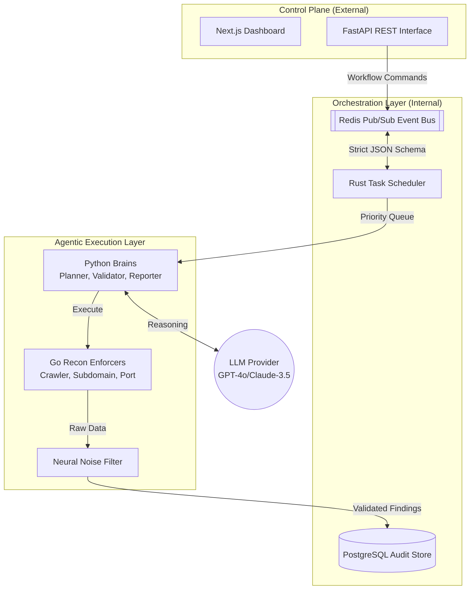
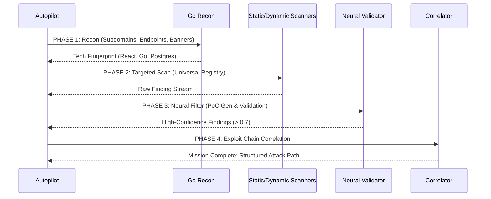

<div align="center">
  
  <h1>⚔️ SecAgent: Autonomous Offensive AI Framework</h1>
  <p><b>Distributed cognitive system for autonomous red-teaming, vulnerability research, and AI safety audits.</b></p>
  
  [](https://opensource.org/licenses/MIT)
  [](https://www.python.org/downloads/)
  [](https://www.rust-lang.org/)
  [](https://go.dev/)
  []()
</div>

---

## ⚡ The Mission: Moving Beyond "Dumb" Scanners

Traditional vulnerability scanners are rigid, noisy, and context-unaware. They follow fixed paths and generate thousands of false positives that waste engineering time.

**SecAgent** is different. It is a **Distributed Cognitive System** that uses autonomous AI agents to **reason** through an attack surface. It doesn't just run tools; it understands the target's technology stack, identifies high-value attack paths, pivots based on intermediate findings, and generates deterministic proof-of-concepts for every exploit.

### 💀 Offensive Capabilities
- **🧠 Neural Orchestration**: A Python-based "Brain" that decomposes high-level mission objectives (e.g., *"Perform full exploit chain on internal RAG pipeline"*) into atomic execution DAGs.
- **🛡️ AI Supply Chain Defense**: Specialized detectors for weaponized assistant configurations (`.cursorrules`, `mcp.json`), prompt injection vectors, and data exfiltration in RAG pipelines.
- **⚡ Hardened Polyglot Core**: 
  - **Rust**: High-speed task scheduling and asynchronous event bus.
  - **Go**: Concurrent reconnaissance, crawling, and network-level I/O.
  - **Python**: LLM reasoning, intent classification, and exploit correlation.
- **🎯 Autonomous PoC Generation**: Automatically crafts deterministic proof-of-concepts (Python/cURL) for discovered vulnerabilities to eliminate false positives.
- **🦾 Neural Filter**: A 99% noise-reduction layer that filters findings through a consensus of specialized AI agents.

---

## 🏛️ Tactical Architecture

SecAgent is engineered for horizontal scale and ultra-low latency, utilizing a polyglot microservice architecture.



### Why Polyglot?
- **Rust**: Chosen for the **Core Scheduler** to ensure memory safety and handle thousands of concurrent events with microsecond latency.
- **Go**: Chosen for the **Recon Engine** because of its native goroutines, allowing for thousands of concurrent HTTP probes and subdomain lookups.
- **Python**: Chosen for the **Agents** to leverage the world-class ecosystem for AI (LangChain, OpenAI, etc.) and rapid exploit development.

---

## 🛠️ Deployment Operations

### 1. Pre-Flight Requirements
- **OS**: Linux, macOS, or Windows (WSL2 Recommended)
- **Hardware**: 4+ Cores, 8GB+ RAM, 2GB Free Space
- **Dependencies**: Python 3.11+, Docker, Node.js (Optional)

### 2. Rapid Installation
The `installer.py` script performs a full technical setup, including preflight diagnostics, virtual environment isolation, and service orchestration.

```bash
# Clone the repository
git clone https://github.com/secagents/secagents.git
cd secagents

# Run the automated technical setup
python installer.py --docker
```

**Installer Options:**
- `--docker`: Deploys the full stack (DB, Redis, API, Engine) via Docker Compose.
- `--no-db`: Skips local PostgreSQL setup (useful for remote DBs).
- `--check`: Runs system diagnostics without making changes.
- `--ci`: Non-interactive mode for automated build pipelines.

---

## 🦾 Operations Manual: Scanning Lifecycle

SecAgent operates in an autonomous lifecycle, most effectively used via **Autopilot Mode**.

### 1. The Autonomous Flow


### 2. Running a Scan (Examples)

**Fire-and-Forget (CLI):**
Ideal for red-teamers who need immediate results without touching a UI.
```bash
python -c "import asyncio; from secagents.modules.autopilot import Autopilot; asyncio.run(Autopilot('target.com').run())"
```

**API-Driven Automation (REST):**
Integrate SecAgent into your CI/CD or automated offensive pipeline.
```bash
# Trigger a deep-depth autopilot scan
curl -X POST http://localhost:8000/workflows/start \
  -H "Content-Type: application/json" \
  -d '{
    "target_id": "YOUR_TARGET_UUID",
    "workflow_type": "autopilot",
    "config": {"depth": "deep", "allow_intrusive": true}
  }'
```

---

## 📊 Example Output: The SecAgent finding

When SecAgent finds a vulnerability, it doesn't just give you a name. It gives you a **validated exploit path**.

### Sample Finding (JSON)
```json
{
  "finding": {
    "title": "Unauthenticated SQL Injection in Search Endpoint",
    "severity": "critical",
    "cwe": "CWE-89",
    "cvss": 9.9,
    "target_url": "https://api.target.com/v1/search",
    "poc_url": "https://api.target.com/v1/search?q=test%27+UNION+SELECT+null,user(),version()--",
    "proof_signal": "MySQL 8.0.35-0ubuntu0.22.04.1",
    "impact": "Full database exfiltration, including user credentials and PII.",
    "remediation": "Implement parameterized queries using SQLAlchemy or prepared statements.",
    "steps_to_reproduce": "1. Navigate to target URL\n2. Inject payload into 'q' parameter\n3. Observe database version in response body."
  }
}
```

### Sample Executive Summary (Markdown)
```markdown
# Security Assessment Report: target.com

## Executive Summary
This assessment identified 1 critical vulnerability. 

| Severity | Count |
|----------|-------|
| Critical | 1     |
| High     | 0     |

## Findings
### Finding 1: Unauthenticated SQL Injection
- **Target**: `https://api.target.com/v1/search`
- **Proof**: `MySQL 8.0.35` confirmed via UNION-based injection.
- **Recommendation**: Sanitize all user-controlled inputs via an ORM layer.
```

---

## ⚙️ Hardening & Configuration (`.env`)

| Sector | Variable | Technical Rationale |
| :--- | :--- | :--- |
| **Intelligence** | `LLM_PROVIDER` | Selects reasoning core (`openai`, `anthropic`, `deepseek`) |
| **Integrations** | `INTERACTSH_SERVER` | OAST server for Out-of-Band vulnerability detection |
| **Performance** | `MAX_SCAN_DEPTH` | Recursion limit for the Go crawler engine |
| **Security** | `ALLOWED_DOMAINS` | Strict whitelist for offensive operations |

---

## 🤝 Contribution Command

SecAgent is an open-source offensive framework. We accept pull requests that enhance the reasoning engine or add new specialized analyzers to the **Universal Analyzer Registry**.

1. **Sync**: Ensure tests pass with `python -m pytest tests/`
2. **Refactor**: Follow the polyglot architectural boundaries.
3. **Submit**: Open a PR with detailed technical impact notes.

---

<div align="center">
  <p><i>SecAgent: Elite Intelligence. Industrial Power.</i></p>
  <b>[ MISSION COMPLETE ]</b>
</div>
