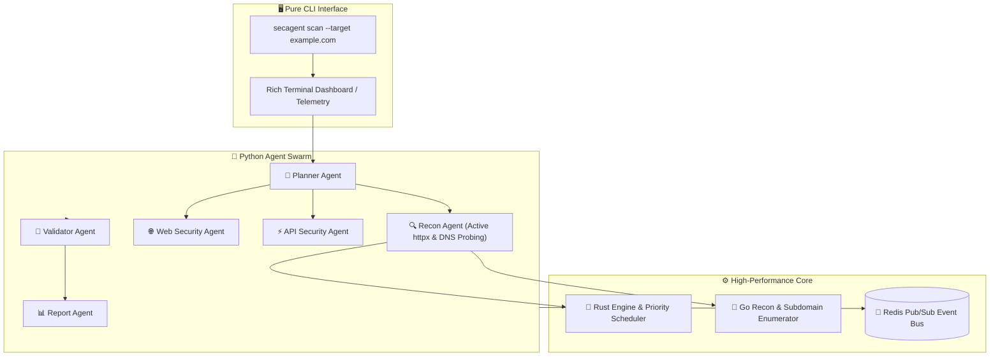

<div align="center">

```text
    _____           ___                    __
   / ___/___  _____/   | ____ ____  ____  / /______
   \__ \/ _ \/ ___/ /| |/ __ `/ _ \/ __ \/ __/ ___/
  ___/ /  __/ /__/ ___ / /_/ /  __/ / / / /_(__  )
 /____/\___/\___/_/  |_\__, /\___/_/ /_/_/   \___/
                      /____/
```

**Autonomous Offensive AI Framework for Red Teams & Security Researchers**

*Industrial Power. Elite Intelligence. Mission Ready.*

---

[](https://opensource.org/licenses/MIT)
[](https://www.python.org/downloads/)
[](https://www.rust-lang.org/)
[](https://go.dev/)
[](https://github.com/gl1tch0x1/cog-ai)
[]()

</div>

---

> ⚠️ **LEGAL DISCLAIMER** — SecAgent is designed exclusively for **authorized security testing, red team engagements, and vulnerability research** on systems you own or have explicit written permission to test. Unauthorized use against systems without permission is illegal. The authors assume no liability for misuse.

---

## 📋 Table of Contents

- [What Is SecAgent](#-what-is-secagent)
- [Capabilities](#-capabilities)
- [Architecture](#-architecture)
- [Quick Start](#-quick-start)
- [Installation Guide](#-installation-guide)
- [Running Your First Scan](#-running-your-first-scan)
- [Releases, Deployments \& Packages](#-releases-deployments--packages)
- [Configuration](#-configuration)
- [Usage Reference](#-usage-reference)
- [Project Structure](#-project-structure)
- [Contributing](#-contributing)

---

## ⚔️ What Is SecAgent

Traditional vulnerability scanners are **rigid, noisy, and context-blind.** They follow fixed paths, miss chained attack vectors, and flood operators with false positives.

**SecAgent is a Pure CLI, High-Performance Red Teaming Framework.**

It functions as a **Distributed Cognitive Security Engine** — using autonomous multi-agent swarms to *reason* through attack surfaces. It analyzes the target stack, discovers subdomains and HTTP services via active `httpx` and Go probes, crafts context-aware payloads, validates findings, and generates impact-first reports.

Built for:
- 🔴 **Red Teams** running head-less CLI engagements
- 🔬 **Security Researchers** auditing complex attack surfaces
- 🐛 **Bug Bounty Hunters** conducting active recon and vulnerability discovery
- 🛡️ **Offensive AI Researchers** testing prompt injection and LLM pipelines

---

## 💀 Capabilities

| Module | Description |
|--------|-------------|
| 🧠 **Neural Swarm Orchestration** | Decomposes security objectives into atomic execution graphs (DAGs) |
| 🔍 **Active Recon Engine** | Asynchronous HTTP/HTTPS probing, active subdomain resolution, link crawling & parameter extraction |
| 🎯 **PoC Validation** | Auto-crafts deterministic proof-of-concepts to verify findings and eliminate false positives |
| 🕸️ **Web3 Auditing** | Smart contract & token ecosystem auditing for EVM and Solana vulnerabilities |
| 🛡️ **AI Supply Chain Audits** | Detects weaponized AI configs (`.cursorrules`, `mcp.json`), prompt injection, and RAG exfiltration |
| ⛓️ **Exploit Chain Correlation** | Links findings into multi-step exploit chains |
| 📊 **Impact-First Deliverables** | Generates executive Markdown and machine-readable JSON reports |

---

## 🏛️ Architecture



---

## ⚡ Quick Start

```bash
# 1. Clone the repository
git clone https://github.com/gl1tch0x1/cog-ai.git
cd cog-ai

# 2. Run the automated installer
python installer.py

# 3. Configure environment secrets
cp .env.example .env
nano .env  # Add OPENAI_API_KEY, ANTHROPIC_API_KEY, or GEMINI_API_KEY

# 4. Initiate an autonomous red-team scan
secagent scan --target example.com --depth standard
```

---

## 🛠️ Installation Guide

### Prerequisites

| Requirement | Minimum | Notes |
|-------------|---------|-------|
| **OS** | Linux / macOS / Windows (native or WSL2) | Fully supported on Windows & Linux |
| **Python** | 3.11+ | Python 3.11, 3.12, and 3.13 |
| **Git** | Installed | For versioning and updates |
| **Docker** | *(Optional)* | For isolated sandbox execution (`--no-sandbox` to bypass) |

### Manual Package Installation

```bash
# Create virtual environment
python -m venv venv

# Activate virtual environment
# Windows:
.\venv\Scripts\activate
# Linux/macOS:
source venv/bin/activate

# Install secagents CLI package in editable mode
pip install -e ./python-agents[dev]
```

---

## 🚀 Running Your First Scan

```bash
# Execute standard scan
secagent scan --target example.com --depth standard --workers 8

# Execute quick scan with local LLM fallback
secagent scan --target target.local --depth quick --setup-local-llm

# Audit local repository for leaked credentials
secagent keyhacks ./src

# Verify system readiness
secagent preflight
```

---

## 📦 Releases, Deployments & Packages

### 🏷️ Releases
- **Current Release**: `v0.3.0-dev`
- **Changelog**: Detailed in [CHANGELOG.md](file:///c:/Users/Acer/Downloads/SecAgent-Updated/SecAgent-Updated/CHANGELOG.md)

### 🚢 Deployments
SecAgent is designed for lightweight, headless CLI operations and containerized worker nodes.

#### Docker Compose Deployment
```bash
# Launch background event bus and core services
docker compose up -d
```
Docker compose provisions:
- `redis`: Pub/Sub event bus
- `rust-core`: Microsecond priority task scheduler
- `recon`: Go-based concurrent scanner

### 📦 Packages

The Python core engine is packaged as `secagents`:

```bash
# Build python package wheel
cd python-agents
python -m build
```
Generates wheel in `python-agents/dist/secagents-0.2.0-py3-none-any.whl`.

---

## ⚙️ Configuration

Environment variables can be set in `.env`:

```env
# Primary LLM Provider Keys
OPENAI_API_KEY=sk-...
ANTHROPIC_API_KEY=sk-ant-...
GEMINI_API_KEY=AIzaSy...

# Operational Settings
ALLOWED_DOMAINS=example.com,target.local
REDIS_URL=redis://localhost:6379/0
RESULTS_DIR=cog-ai-results
```

---

## 💻 Usage Reference

```text
usage: secagent [-h] [--version]
                {scan,vault,keyhacks,preflight,update,hardware,worker} ...

positional arguments:
  scan       Execute autonomous red-team pipeline
  vault      Interface with secret storage and API keys
  keyhacks   Scan local assets for leaked credentials
  preflight  Validate system readiness
  update     Check and apply framework updates
  hardware   Hardware-aware model optimization
  worker     Start background workflow processor
```

---

## 📁 Project Structure

```text
SecAgent/
├── python-agents/           # Primary Python AI Swarm & CLI
│   └── secagents/
│       ├── agents/          # Recon, Web, API, Web3, Validator, Reporter agents
│       ├── core/            # Orchestrator, Worker Pool, Memory Graph
│       ├── modules/         # CVE checks, payload generators
│       └── cli.py           # Rich CLI entrypoint
├── go-services/             # Go microservices
│   ├── recon/               # Subdomain & HTTP probe engine
│   └── scanners/            # High-speed network scanners
├── rust-core/               # Rust engine, scheduler & event bus
├── docker-compose.yml       # Production services configuration
├── Makefile                 # Unified build & test commands
├── installer.py             # Automated bootstrap installer
├── update.py                # Intelligence update engine
└── SKILL.md                 # Advanced hunting knowledge base
```

---

## 🤝 Contributing

Contributions are welcome! Please follow these steps:
1. Fork the repository
2. Create a feature branch (`git checkout -b feature/awesome-check`)
3. Ensure all tests pass (`pytest`) and code is linted (`ruff check python-agents`)
4. Submit a Pull Request

---

## 📄 License

Distributed under the MIT License. See [LICENSE](file:///c:/Users/Acer/Downloads/SecAgent-Updated/SecAgent-Updated/LICENSE) for details.
