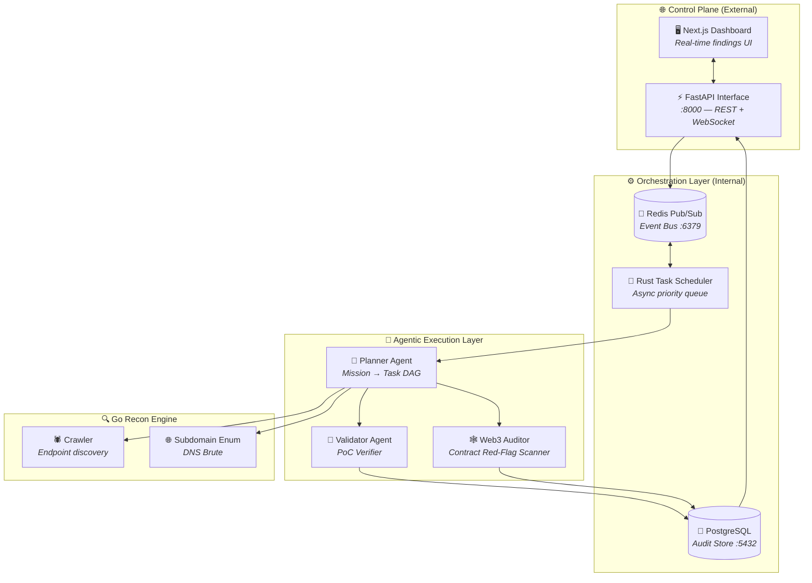
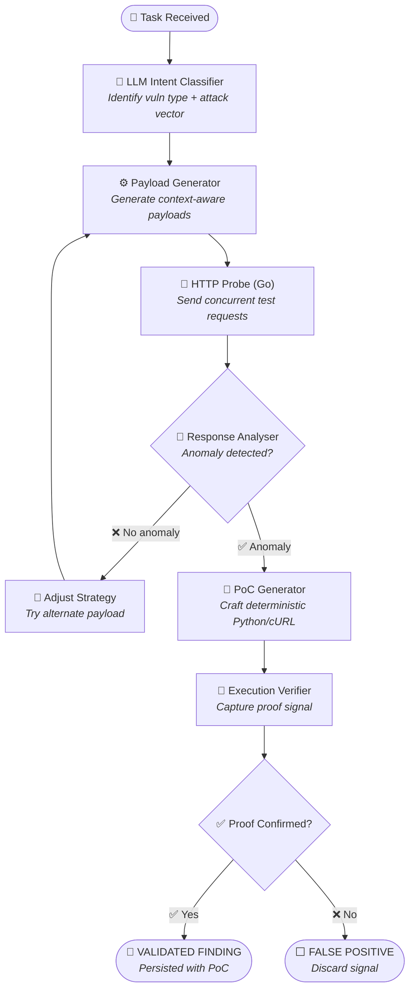

<div align="center">

```
    _____           ___                    __
   / ___/___  _____/   | ____ ____  ____  / /______
   \__ \/ _ \/ ___/ /| |/ __ `/ _ \/ __ \/ __/ ___/
  ___/ /  __/ /__/ ___ / /_/ /  __/ / / / /_(__  )
 /____/\___/\___/_/  |_\__, /\___/_/ /_/_/   \___/
                      /____/
```

**Autonomous Offensive AI Framework for Red Teams & Security Researchers**

*Industrial Power. Elite Intelligence. Mission Ready.*

---

[](https://opensource.org/licenses/MIT)
[](https://www.python.org/downloads/)
[](https://www.rust-lang.org/)
[](https://go.dev/)
[](https://github.com/gl1tch0x1/cog-ai)
[]()

</div>

---

> ⚠️ **LEGAL DISCLAIMER** — SecAgent is designed exclusively for **authorized security testing, red team engagements, and vulnerability research**. Unauthorized use against systems without permission is illegal. The authors assume no liability for misuse.

---

## ⚔️ The Vision: Why SecAgent?

Traditional vulnerability scanners operate on rigid, linear checklists. They lack the "cognitive pivot" required to identify complex exploit chains. **SecAgent** is an **AI-Native Distributed Cognitive System** engineered to replicate the reasoning patterns of a human elite operator.

It doesn't just run tools; it **orchestrates an arsenal.** By leveraging a polyglot engine (Rust/Go/Python) and a swarm of autonomous agents, SecAgent understands the technical stack, identifies high-value attack paths, and generates **deterministic proof-of-concepts** for every confirmed vulnerability.

---

## 💀 Elite Capabilities

| Module | Purpose | Impact |
|--------|---------|--------|
| 🧠 **Neural Orchestration** | Mission Decomposition | Transforms high-level objectives into executable Task DAGs. |
| 🔍 **Autonomous Recon** | High-Speed Discovery | Go-powered concurrent subdomain enum and endpoint crawling. |
| 🕸️ **Web3 Auditing** | Contract Hardening | Detects rug-pull vectors (Hidden Mint, LP Drain) in EVM & Solana. |
| 🛡️ **AI Supply Chain** | AI Safety Audit | Detects weaponized `.cursorrules`, prompt injection, and RAG leaks. |
| 🔬 **Offensive Intel** | Advanced Signatures | 20+ vuln classes and 50+ contract red-flags from Claude Bug Bounty. |
| 🦾 **Neural Filter** | 99% Noise Reduction | Consensus-based validation eliminates thousands of false positives. |
| ⛓️ **Exploit Chaining** | Attack Path Correlation | Links individual signals into full multi-step breach scenarios. |
| 📊 **Elite Reporting** | Executive Deliverables | CVSS 4.0 compliant, impact-first Markdown/JSON/HTML reports. |

---

## 📋 Table of Contents

1.  [What Is SecAgent](#-the-vision-why-secagent)
2.  [Capabilities](#-elite-capabilities)
3.  [Deep Architecture](#-deep-architecture)
    *   [High-Level Topology](#1-system-architecture--high-level-topology)
    *   [Autonomous Scan Workflow](#2-autonomous-scan-workflow--end-to-end-lifecycle)
    *   [Agent Decision Logic](#3-agent-architecture--internal-decision-logic)
4.  [Quick Start](#-quick-start)
5.  [Installation Universe](#-installation-universe)
    *   [Method 1: Automated (Recommended)](#method-1--automated-deployment-recommended)
    *   [Method 2: Docker Fortress (Isolated)](#method-2--docker-fortress-isolated)
    *   [Method 3: Manual (Advanced)](#method-3--manual-deployment-advanced)
6.  [Operational Intelligence (Configuration)](#-operational-intelligence-configuration)
    *   [The Manifest (.env) Guide](#the-manifest-env--detailed-parameters)
    *   [Scope Control](#scope-control-enforcement)
7.  [Mission Operations (Usage)](#-mission-operations-usage)
    *   [Scan Reference](#1-autonomous-scan)
    *   [Vault Mastery](#2-operational-vault)
    *   [Intelligence Recall](#3-intelligence-recall-update)
8.  [The Specialist Agents](#-the-specialist-agents)
9.  [Project Structure](#-project-structure)
10. [Field Troubleshooting](#-field-troubleshooting)

---

## 🏛️ Deep Architecture

SecAgent is a high-performance polyglot system designed for horizontal scale and ultra-low latency.

### 1. System Architecture — High-Level Topology



---

### 2. Autonomous Scan Workflow — End-to-End Lifecycle

```mermaid
sequenceDiagram
    autonumber
    actor Operator as 🔴 Operator
    participant CLI as 🖥️ Entrypoint (./secagent)
    participant Planner as 🧠 Planner Agent
    participant Recon as 🔍 Go Recon Engine
    participant Scanners as 🛡️ Specialist Agents
    participant Filter as 🦾 Neural Filter
    participant DB as 🐘 PostgreSQL

    Operator->>CLI: ./secagent scan --target airbnb.com
    CLI->>Planner: Initialize mission: target=airbnb.com

    rect rgb(26, 26, 46)
        Note over Planner,Recon: PHASE 1 — RECONNAISSANCE
        Planner->>Recon: Enumerate subdomains, endpoints, banners
        Recon-->>Planner: Tech Fingerprint (React 18, Go 1.21, PostgreSQL)
    end

    rect rgb(15, 52, 96)
        Note over Planner,Scanners: PHASE 2 — TARGETED SCANNING
        Planner->>Scanners: Dispatch parallel tasks (SQLi, IDOR, Web3)
        Scanners-->>Planner: Raw finding stream (unvalidated)
    end

    rect rgb(83, 52, 131)
        Note over Planner,Filter: PHASE 3 — NEURAL VALIDATION
        Planner->>Filter: Request consensus on findings
        Filter->>Scanners: Execute deterministic PoCs
        Scanners-->>Filter: Capture proof signals
        Filter-->>Planner: Validated findings (Confidence > 0.7)
    end

    Planner->>DB: Persist findings & generate report
    CLI-->>Operator: ✅ Mission Complete: report.md ready
```



---

### 3. Agent Architecture — Internal Decision Logic



---

## ⚡ Quick Start

Deploy and execute your first mission in under 5 minutes.

```bash
# 1. Clone the repository
git clone https://github.com/gl1tch0x1/cog-ai.git
cd cog-ai

# 2. Deploy the Arsenal (Automated Installer)
python3 installer.py

# 3. Execute Mission
./secagent scan --target example.com --depth quick
```

---

## 🛠️ Installation Universe

### Prerequisites
- **Python 3.11+**: Core agent runtime.
- **Docker & Compose**: For service isolation.
- **Rust**: Required for building high-performance dependencies (e.g., `pydantic-core`).
- **Git**: For framework synchronization.

---

### Method 1 — Automated Deployment (Recommended)
The most robust path. The installer autonomously handles virtual environments, binary pre-loading, and API ignition.

```bash
python3 installer.py
```
**What happens?**
1.  **Preflight**: Verifies Python, Rust, and tool binaries.
2.  **Hardening**: Creates isolated `.venv` and upgrades deployment tools.
3.  **Arming**: Pre-installs critical binaries (`pydantic`, `rich`, `httpx`) and mounts framework modules.
4.  **Intel**: Generates cryptographically secure keys in `.env`.
5.  **Entrypoints**: Deploys `./secagent` and `secagent.bat`.
6.  **Ignition**: Starts the API Control Plane on Port 8000.

---

### Method 2 — Docker Fortress (Isolated)
Full polyglot stack in isolated containers. Best for production stability.

```bash
python3 installer.py --docker
```
**Services Deployed:**
- **PostgreSQL**: Findings & audit store.
- **Redis**: High-speed task queue.
- **Go-Recon**: High-performance discovery engine.
- **FastAPI**: Central Control Plane.
- **Next.js**: Visual Intelligence Dashboard.

---

### Method 3 — Manual Deployment (Advanced)
For researchers who require granular control over each component.

**1. Database & Queue Setup**
Ensure PostgreSQL (15+) and Redis (7+) are running on your host.

**2. Virtual Environment**
```bash
python3 -m venv .venv
source .venv/bin/activate  # Windows: .venv\Scripts\activate
```

**3. Module Installation**
```bash
# Core Agents
pip install -e ./python-agents[dev,browser]
# API Server
pip install -e ./api[dev]
```

**4. Recon Engine Build**
```bash
cd go-services
go build -o ../recon-service ./cli/cmd/main.go
```

**5. Database Migration**
```bash
cd api
alembic upgrade head
```

---

## ⚙️ Operational Intelligence (Configuration)

### The Manifest (`.env`) — Detailed Parameters

| Variable | Type | Description |
|----------|------|-------------|
| `DB_PASSWORD` | Secret | Randomly generated password for PostgreSQL. |
| `DATABASE_URL` | URI | Connection string for findings persistence. |
| `REDIS_URL` | URI | Task queue bus for agent coordination. |
| `JWT_SECRET` | Secret | Used for securing API control-plane access. |
| `ALLOWED_DOMAINS` | List | **STRICT WHITELIST**. Only these domains can be scanned. |
| `OPENAI_API_KEY` | Key | Primary reasoning engine for GPT-4o. |
| `ANTHROPIC_API_KEY` | Key | Primary engine for deep exploit reasoning (Claude 3.5). |
| `GROQ_API_KEY` | Key | Low-latency engine for fast recon triage. |
| `MAX_CONCURRENT_AGENTS` | Int | Parallel workers for the agent swarm (Default: 4). |

### Scope Control Enforcement
SecAgent is **Fail-Closed**. Every mission is checked against `ALLOWED_DOMAINS` in your `.env`.
```ini
ALLOWED_DOMAINS=example.com,*.example.com,target-org.org
```
*Requests outside this scope are terminated before any probing occurs.*

---

## 🎯 Mission Operations (Usage)

### 1. Autonomous Scan
Initiate the full offensive pipeline using the elite entrypoint.
```bash
./secagent scan --target airbnb.com --depth standard --workers 8
```
**Flags:**
- `--depth`: `quick` (fast recon), `standard` (full audit), `deep` (exploit chaining).
- `--workers`: Number of parallel specialist agents.
- `--no-sandbox`: Bypasses Docker isolation (not recommended).
- `--results-dir`: Custom path for breach reports.

### 2. Operational Vault
Manage and validate your secret manifest.
```bash
./secagent vault --validate
```
*Performs live connectivity checks for all LLM providers and database uplinks.*

### 3. Intelligence Recall (Update)
Synchronize the framework with the latest intelligence from origin.
```bash
./secagent update
```
**Robust Recovery:** If local conflicts are detected, the utility offers a **Hard Reset** path to restore framework integrity autonomously.

---

## 🛡️ The Specialist Agents

SecAgent coordinates a swarm of highly focused agents, each optimized for a specific bug class.

1.  **ReconAgent**: High-speed discovery. Uses Go to map subdomains, endpoints, and technology fingerprints.
2.  **WebSecurityAgent**: Advanced Web2 specialist. Covers XSS, SQLi, SSRF (11 bypasses), LFI, and RCE.
3.  **APISecurityAgent**: API specialist. Audits BOLA/IDOR (V1-V8), JWT, GraphQL, MFA, and SAML.
4.  **Web3SecurityAgent**: Smart contract auditor. 50+ patterns for EVM and Solana (Rug-pull vectors).
5.  **ValidatorAgent**: The Neural Filter. Executes deterministic PoCs to confirm/discard findings.
6.  **ReportAgent**: Impact-first delivery. Generates executive summaries and CVSS 4.0 calculations.

---

## 📁 Project Structure

```
cog-ai/
├── api/                # FastAPI REST Control Plane
├── python-agents/      # Core AI Agent System (SecAgents)
│   └── secagents/
│       ├── agents/     # Specialist Agent Definitions
│       ├── pipeline/   # End-to-End Mission Runner
│       └── prompts/    # Cognitive Decision Framework
├── go-services/        # High-Performance Recon Engine (Go)
├── rust-core/          # Async Task Scheduler (Tokio)
├── wordlists/          # 500KB+ Curated Offensive Security Lists
├── installer.py        # Elite Zero-Interaction Deployment Engine
├── update.py           # Intelligence Recall & Sync Utility
├── secagent            # Linux/macOS Auto-Activation Entrypoint
└── secagent.bat        # Windows Auto-Activation Entrypoint
```

---

## 🔍 Field Troubleshooting

**1. Port 8000 Already in Use**
The `installer.py` now includes an **Automatic Port Cleanup** feature. If Port 8000 is busy, it will attempt to terminate the stale process using `fuser` (Unix) or `taskkill` (Windows).

**2. Module Not Found: secagents**
This occurs when running with system Python instead of the virtual environment. **Always use the entrypoint**:
```bash
./secagent scan ...
```

**3. Synchronization Collapsed (Git Conflict)**
Run the force-synchronize command to align your local environment:
```bash
./secagent update --force  # Or: git fetch origin && git reset --hard origin/main
```

---

<div align="center">

**SecAgent: Elite Intelligence. Industrial Power.**

*Built for professionals who think in attack paths, not checklists.*

`[ MISSION COMPLETE ]`

---

[Report a Bug](https://github.com/gl1tch0x1/cog-ai/issues) · [Request a Feature](https://github.com/gl1tch0x1/cog-ai/issues) · [Security Policy](SECURITY.md)

</div>
